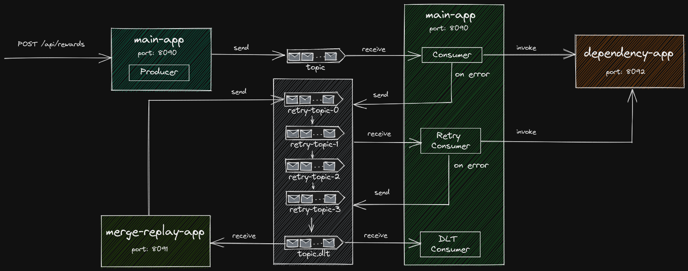

# Kafka Error Handling App

This is a concept implementation of an error handling pattern to be used in the Microservices architecture.

Application integrating with Kafka and other similar message brokers and event streaming platforms should take into consideration of the patterns to reprocess information/data on failures. Failures may happen in the downstream systems/services due to any unforseen situation and as such it should be the responsibility of the message processor to ensure the failures doesn't result in a data loss and it can be reprocessed when the underlying dependencies are back online.

For a broader view of the error handling strategy and patterns to be used in Kafka based architecure, refer the following articles.

- [Error Handling Patterns for Apache Kafka Applications](https://www.confluent.io/blog/error-handling-patterns-in-kafka/)
- [Building Reliable Reprocessing and Dead Letter Queues with Apache Kafka ](https://eng.uber.com/reliable-reprocessing/)

This GitHub repo provides an implementation of the reliable reprocessing pattern. The concepts demonstrated are as follows:

- Microservice built with Spring Boot
- REST API controller
- Kafka producer and consumer implementation
- Usage of Apache Avro for data serialisation and integration with Confluent Schema Registry to validate the data against a predefined schema
- Implements Avro union types which provides extensible approach to support strong typing and schema validation for supporting multiple message types per topic 
- Kafka retry implentation using retry and Dead Letter Topic (DLT) with step up interval between retries
- DLT processor for logging and alerting
- Multiple applications with separation of concerns co-ordinating to complete a flow
- A merge replay Spring Boot application to replay messages for reliable reprocessing

This concept implementation is built with the following technologies:

- Java 17
- Spring Boot
- Apache Kafka
- Spring Kafka
- Apache Avro
- Confluent Schema Regsitry

## Architecture


The components are:

* main-app: This is a Spring Boot microservice providing a REST interface to receive some data and has a Kafka producer and consumer implementation.
  - Will be running on port: 8090
  - The REST Controller will accept a typed data
  - The producer publishes the data to a Kafka topic.
  - The consumer will be listening to the Kafka topic and processes the incoming stream of messages. The consumer makes a RESTful API call to a downstream dependency application. This is somewhat similar to some real-world use cases and allows demonstration of the behaviour when a downstream application is not available.
  - The retry consumer responsible for processing messages from the retry topics.
  - Last but not least, a consumer to process messages from the DLT.
* dependency-app: This is a Spring Boot microservice providing a REST interfac and acts as a depdendency for the main-app
* merge-replay-app: This is a Spring Boot application responsible for reliably reprocessing messages which are not processed due to errors such as unavailability of the down stream service.
* Kafka topics: set of Kafka topics containing messages.
  - Main topic: the producer publishes messages to this topic and the consumer receives the data from the topic.
  - Set of retry topics: on different step-up intervals, the consumer retries the expected processing by calling the dependency-app and if the retry is not successful, the message is moved from one retry topic to another.
  - The retry logic is based on a step up interval. The first retry will be after 3 seconds, followed by 6, 12, 24 and 32 seconds.
  - If all the retries are exhaused and still the underlying depdency is not available, the message will be moved to a Dead Letter Topic (DLT)
  - DLT processor will receive messages from the topic and logs diagnostic info as needed. Alerting and incident management can be integrated here to alert Ops teams.

## Pre-requisites
 To run this setup, some pre-requisites are required to be installed and configured. Following are some guides which should help.

 - [Setup Linux VM on Azure](https://ramamurthyk.github.io/notes/Linux%20Setup%20on%20Azure%207100b190bfac4cc2a089ec436d50a95b)
 - [Java Setup](https://ramamurthyk.github.io/notes/Linux%20Setup%20on%20Azure%207100b190bfac4cc2a089ec436d50a95b/Java%20Setup%20on%20Linux%2036774edcda1343ae9bb9cfde10cdba6c)
 - [Docker Setup](https://ramamurthyk.github.io/notes/Linux%20Setup%20on%20Azure%207100b190bfac4cc2a089ec436d50a95b/Docker%20Setup%20on%20Linux%20b60c631d0f0b40288a4bb64b6aac82c8)
 - [Kafka Setup](https://ramamurthyk.github.io/notes/Linux%20Setup%20on%20Azure%207100b190bfac4cc2a089ec436d50a95b/Kafka%20Setup%20on%20Linux%2013001e06272949d8ab85130d54c98e62)
 - [VS Code Setup](https://ramamurthyk.github.io/notes/Linux%20Setup%20on%20Azure%207100b190bfac4cc2a089ec436d50a95b/VS%20Code%20Setup%20on%20Linux%20e92fb84f2c914205bb007c42a40d0d98)

## Code setup

- Clone the git repo locally
- Open in VS Code or any Java IDE
- Open the terminal and navigate to the root directory
  - execute mvn clean
  - Navigate to the common-lib directory and execute mvn compile install
  - Then from the root directory of the repo, execute mvn compile package

This should compile all the applications. Run both main-app and dependency-app from the command line or via VS Code and ensure both applications are up and running.

## Execution
Follow these steps to test the application.

### Standard path
When all the dependencies are up and running, the main-app receives the data via REST controller and publishes it to a Kafka topic. The consumer processes the message from the topic and invokes a REST API in dependency-app running on 8092 port. This mimicks a down stream dependency typically found in real world applications.

1. Post a message to the REST API Controller in the main-app.

``` Bash
POST http://localhost:8090/api/rewards

Content-Type: application/json
 
{
    "customerId": 1001,
    "programme": "Mindfulness",
    "membershipId": "M1234"
}
```
2. Inspect the main-app producer logs

``` Bash
2022-05-10 21:47:55.673  INFO 25631 --- [nio-8090-exec-6] app.kafka.mainapp.reward.RewardProducer  : Produced -> key: 1001, value: {"customerId": 1001, "membershipId": "M1234", "programme": "Mindfulness"}
```

3. Inspect the main-app consumer logs

``` Bash
2022-05-10 21:47:55.676  INFO 25631 --- [rewards-1-0-C-1] app.kafka.mainapp.reward.RewardConsumer  : process: Received <- key: 1001. value: {"customerId": 1001, "membershipId": "M1234", "programme": "Mindfulness"} in topic: rewards, offset: 28
2022-05-10 21:47:55.676 DEBUG 25631 --- [rewards-1-0-C-1] o.s.web.client.RestTemplate              : HTTP POST http://localhost:8092/api/external
2022-05-10 21:47:55.677 DEBUG 25631 --- [rewards-1-0-C-1] o.s.web.client.RestTemplate              : Accept=[application/json, application/*+json]
2022-05-10 21:47:55.677 DEBUG 25631 --- [rewards-1-0-C-1] o.s.web.client.RestTemplate              : Writing [Customer[customerId=1001]] with org.springframework.http.converter.json.MappingJackson2HttpMessageConverter
```
4. Inspect the dependency-app logs.

``` Bash
2022-05-10 21:47:55.680  INFO 25656 --- [nio-8092-exec-6] app.kafka.dependencyapp.ApiController    : Processing customer: 1001
```

### Alternate path
Demonstrates the retry pattern when the dependencies are not available or in case of errors in processing the message.  Stop the dependency-app to simulate the error scenario.

1. Post a message to the REST API Controller in the main-app.

``` Bash
POST http://localhost:8090/api/rewards

Content-Type: application/json
 
{
    "customerId": 1002,
    "programme": "Mindfulness",
    "membershipId": "M1234"
}
```
2. Inspect the main-app producer logs

``` Bash
2022-05-10 22:01:43.780  INFO 25631 --- [nio-8090-exec-9] app.kafka.mainapp.reward.RewardProducer  : Produced -> key: 1002, value: {"customerId": 1002, "membershipId": "M1234", "programme": "Mindfulness"}
```

3. Inspect the main-app consumer logs

``` Bash
Received message in the main topic:
2022-05-10 22:01:43.781  INFO 25631 --- [rewards-1-0-C-1] app.kafka.mainapp.reward.RewardConsumer  : process: Received <- key: 1002. value: {"customerId": 1002, "membershipId": "M1234", "programme": "Mindfulness"} in topic: rewards, offset: 29

On error the message is posted to retry-0 topic and is received by the retry consumer:
2022-05-10 22:01:47.540  INFO 25631 --- [r.retry-0-0-C-1] app.kafka.mainapp.reward.RewardConsumer  : process: Received <- key: 1002. value: {"customerId": 1002, "membershipId": "M1234", "programme": "Mindfulness"} in topic: rewards.consumer.retry-0, offset: 167

On error the message is posted to retry-1 topic and is received by the retry consumer:
2022-05-10 22:01:54.065  INFO 25631 --- [r.retry-1-0-C-1] app.kafka.mainapp.reward.RewardConsumer  : process: Received <- key: 1002. value: {"customerId": 1002, "membershipId": "M1234", "programme": "Mindfulness"} in topic: rewards.consumer.retry-1, offset: 41

On error the message is posted to retry-2 topic and is received by the retry consumer:
2022-05-10 22:02:07.568  INFO 25631 --- [r.retry-2-0-C-1] app.kafka.mainapp.reward.RewardConsumer  : process: Received <- key: 1002. value: {"customerId": 1002, "membershipId": "M1234", "programme": "Mindfulness"} in topic: rewards.consumer.retry-2, offset: 41

On error the message is posted to retry-3 topic and is received by the retry consumer:
2022-05-10 22:02:33.072  INFO 25631 --- [r.retry-3-0-C-1] app.kafka.mainapp.reward.RewardConsumer  : process: Received <- key: 1002. value: {"customerId": 1002, "membershipId": "M1234", "programme": "Mindfulness"} in topic: rewards.consumer.retry-3, offset: 40

On error the message is finally posted to DLT and is received by the DLT consumer:
2022-05-10 22:02:33.586  INFO 25631 --- [sumer.dlt-0-C-1] app.kafka.mainapp.reward.RewardConsumer  : processDlt: Received <- key: 1002. value: {"customerId": 1002, "membershipId": "M1234", "programme": "Mindfulness"} in topic: rewards.consumer.dlt, offset: 34
```
4. Run the depdendency-app

5. Run the merge-replay-app

6. Inspect merge-replay-app logs

The failed message(s) from the DLT will be posted back to retry-0 topic.

```Bash
2022-05-10 22:08:56.949  INFO 126020 --- [rds-merge-0-C-1] app.kafka.mergereplayapp.Merger          : Assignments:{rewards.consumer.dlt-0=34}
2022-05-10 22:08:57.071  INFO 126020 --- [rds-merge-0-C-1] app.kafka.mergereplayapp.Merger          : process: Received <- key: 1002. value: {"customerId": 1002, "membershipId": "M1234", "programme": "Mindfulness"} in topic: rewards.consumer.dlt, offset: 34
2022-05-10 22:08:57.127  INFO 126020 --- [rds-merge-0-C-1] a.k.m.reward.RewardProducer              : Produced -> key: 1002, value: {"customerId": 1002, "membershipId": "Mindfulness", "programme": "M1234"}
```
7. Inspect the main-app consumer logs

```Bash
The message is received in retry-0 topic:
2022-05-10 22:08:57.138  INFO 25631 --- [r.retry-0-0-C-1] app.kafka.mainapp.reward.RewardConsumer  : process: Received <- key: 1002. value: {"customerId": 1002, "membershipId": "Mindfulness", "programme": "M1234"} in topic: rewards.consumer.retry-0, offset: 168

And sent to dependency-app REST API.
2022-05-10 22:08:57.138 DEBUG 25631 --- [r.retry-0-0-C-1] o.s.web.client.RestTemplate              : HTTP POST http://localhost:8092/api/external
2022-05-10 22:08:57.139 DEBUG 25631 --- [r.retry-0-0-C-1] o.s.web.client.RestTemplate              : Accept=[application/json, application/*+json]
2022-05-10 22:08:57.139 DEBUG 25631 --- [r.retry-0-0-C-1] o.s.web.client.RestTemplate              : Writing [Customer[customerId=1002]] with org.springframework.http.converter.json.MappingJackson2HttpMessageConverter
2022-05-10 22:08:57.280 DEBUG 25631 --- [r.retry-0-0-C-1] o.s.web.client.RestTemplate              : Response 200 OK
```
## Merge Replay App 
This merge-replay-app supports the following modes.

1. Retrieve all messages from the initial or a specified offset and publish them to a retry topic

```Bash
# Set the offset value to retrieve messages.
app.rewards.kafka.consumer.offset=0
# Set the value to false so that the messages are retrieved from the specified offset although the current offset commit may be different.
app.rewards.kafka.consumer.seekToCurrent=false
```

2. Retrieve all new messages from the last committed offset and publish them to a retry topic
```Bash
# Set the offset value to retrieve messages.
app.rewards.kafka.consumer.offset=0
# Set the value to true so that new messages are retrieved from the last committed offset.
app.rewards.kafka.consumer.seekToCurrent=true
```
It's an implementation of the AbstractConsumerSeekAware component.
```Java
@Component
@Slf4j
public class Merger extends AbstractConsumerSeekAware {
    @Autowired
    private ApplicationProperties applicationProperties;

    @Autowired
    private RewardProducer rewardProducer;

    @KafkaListener(id = "${app.rewards.kafka.consumer.group-id}", topics = "${app.topic.rewards.consumer.dlt}")
    public void process(ConsumerRecord<Integer, Object> record,
            @Header(KafkaHeaders.RECEIVED_TOPIC) String topic, @Header(KafkaHeaders.OFFSET) long offset) {
        log.info(String.format("process: Received <- key: %s. value: %s in topic: %s, offset: %s",
                record.key(), record.value(), topic, offset));
       ...

        Reward reward = new Reward(customerId, membershipId, programme);
        rewardProducer.resendRewardCreatedMessage(reward);
    }

    @Override
    public void onPartitionsAssigned(Map<TopicPartition, Long> assignments, ConsumerSeekCallback callback) {
        log.info("Assignments:" + assignments);
        super.onPartitionsAssigned(assignments, callback);

        callback.seekRelative(applicationProperties.rewardsConsumerDLT, applicationProperties.partition,
                applicationProperties.offset, applicationProperties.seekToCurrent);
    }
}
```

## Conclusion
This concept implementation demonstrates one of the important error handling strategy while using Kafka as an event streaming platform. It describes an implementation approach to reliably process messages and reuse of the consumer implementation to process messages from the original and set of retry topics. It has a powerful utility application which can be used by IT operations teams to trigger reprocessing when needed.